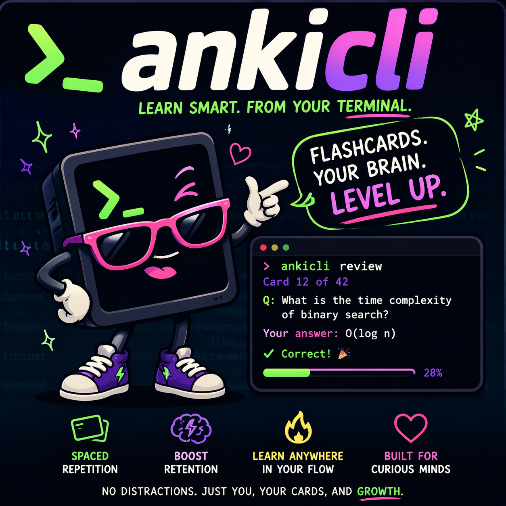

# ankicli



Docs and product site: [takhoffman.github.io/ankicli](https://takhoffman.github.io/ankicli/)

Goal-driven study: [learning plans](https://takhoffman.github.io/ankicli/docs/learning-plans/)

`ankicli` is a local-first Anki CLI for humans who want to install and supervise a safe, scriptable
control surface for agent harnesses like Claude, Codex, OpenClaw, and custom automation.

Installed by humans. Operated by agents.

Supported platforms: macOS, Windows, and Linux.

## Why It Exists

Use `ankicli` when you want:

- a terminal-native Anki control surface that agents can drive safely
- a human-friendly install and verification path
- profile-aware local collection access
- explicit dry-run, confirmation, backup, and sync-preflight flows
- stable JSON output for automation instead of fragile desktop UI scripting

## Install

macOS and Linux:

```bash
curl -fsSL https://raw.githubusercontent.com/Takhoffman/ankicli/main/scripts/install.sh | sh
```

Windows:

```powershell
irm https://raw.githubusercontent.com/Takhoffman/ankicli/main/scripts/install.ps1 | iex
```

Fallback package path:

```bash
pipx install ankicli
```

## Verify

Run these before handing `ankicli` to an agent:

```bash
ankicli --version
ankicli --json doctor env
ankicli --json doctor backend
ankicli --json profile list
```

## First Steps

Inspect the local environment and confirm the target profile before real work:

```bash
ankicli --json profile default
ankicli --json --profile "User 1" collection info
ankicli --json --profile "User 1" search preview --kind notes --query 'deck:Default' --limit 5
ankicli --json --profile "User 1" note add-tags --id 123 --tag review --dry-run
```

## What You Can Do

- inspect profiles, collections, decks, models, tags, cards, and media
- search and preview notes/cards before changing anything
- mutate notes and card state with explicit dry-run and confirmation paths
- create local backups and run explicit restore flows
- inspect auth state and run sync preflight before real sync work
- run local tutor-style study sessions from the terminal

## Safety Defaults

- Prefer `--json` for scripts and agents.
- Use `--dry-run` first on write-capable commands.
- Prefer `--profile` for normal local usage and `--collection` for explicit low-level targeting.
- Use `sync status` as the safe preflight before running a real sync.
- Sync is not backup. Use `backup create` or the built-in auto-backup flow when rollback matters.
- Riskier local `python-anki` writes create an automatic pre-mutation backup unless you pass
  `--no-auto-backup`.
- Real `note delete`, `card suspend`, and `card unsuspend` require `--yes`.

## Docs

- Product site: [takhoffman.github.io/ankicli](https://takhoffman.github.io/ankicli/)
- Learning plans: [learning plans](https://takhoffman.github.io/ankicli/docs/learning-plans/)
- Recipes: [recipes](https://takhoffman.github.io/ankicli/docs/recipes/)
- CLI guide: [cli guide](https://takhoffman.github.io/ankicli/docs/cli-guide/)
- Common tasks: [common tasks](https://takhoffman.github.io/ankicli/docs/common-tasks/)
- Quickstart: [quickstart](https://takhoffman.github.io/ankicli/docs/quickstart/)
- Install guide: [install](https://takhoffman.github.io/ankicli/install/)
- Profiles and collections: [profiles and collections](https://takhoffman.github.io/ankicli/docs/profiles-and-collections/)
- Sync and backups: [sync and backups](https://takhoffman.github.io/ankicli/docs/sync-and-backups/)
- Study mode: [study](https://takhoffman.github.io/ankicli/docs/study/)
- Troubleshooting: [troubleshooting](https://takhoffman.github.io/ankicli/docs/troubleshooting/)

Every major docs page is designed to be readable by humans and easy to copy into an LLM chat.

## For Contributors And Advanced Backend Work

The top-level README is intentionally product-oriented. Contributor and backend-contract detail still
exists, but it lives in deeper docs and repo files:

- CLI and backend contract: [`docs/spec.md`](/Users/thoffman/ankicli/docs/spec.md)
- Release/install workflows: [product site](https://takhoffman.github.io/ankicli/)
- Source and workflows: [repository](https://github.com/Takhoffman/ankicli)

Common contributor commands:

```bash
uv sync --extra dev --frozen
PYTEST_PLUGINS=ankicli.pytest_plugin uv run pytest -c pyproject.toml -m "unit or smoke" --proof-report /tmp/ankicli-proof-report.json
uv run ruff check .
uv build
uv run pytest -m distribution
```
